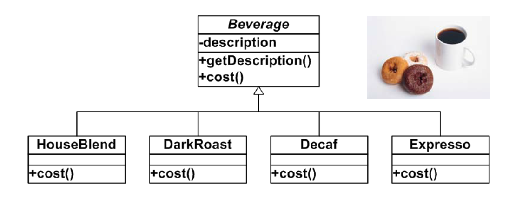
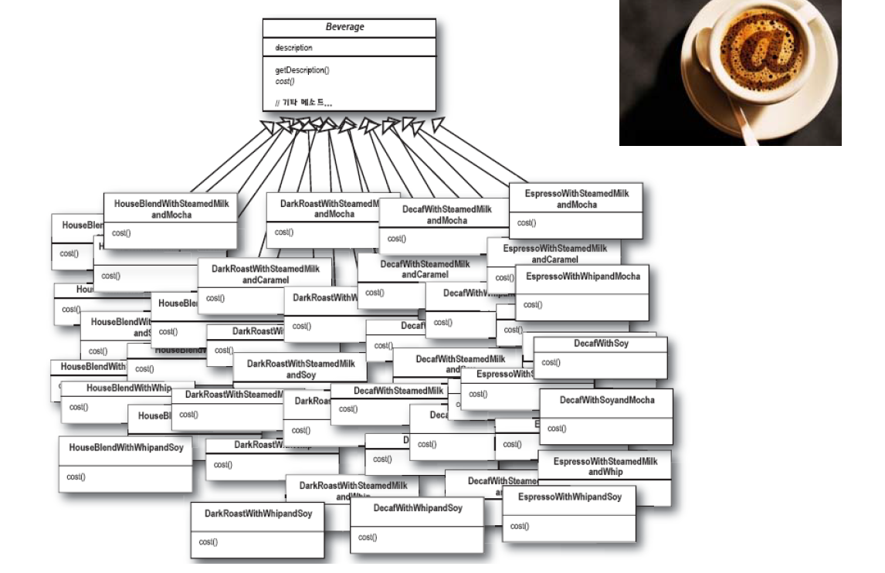
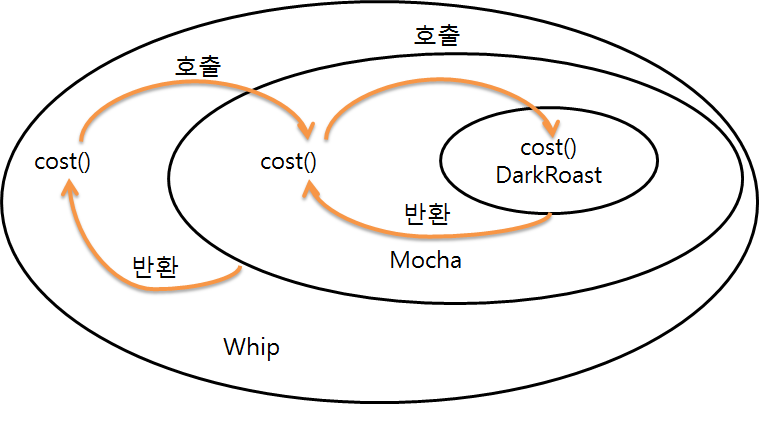
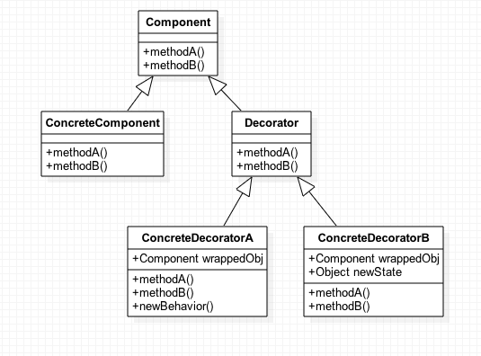
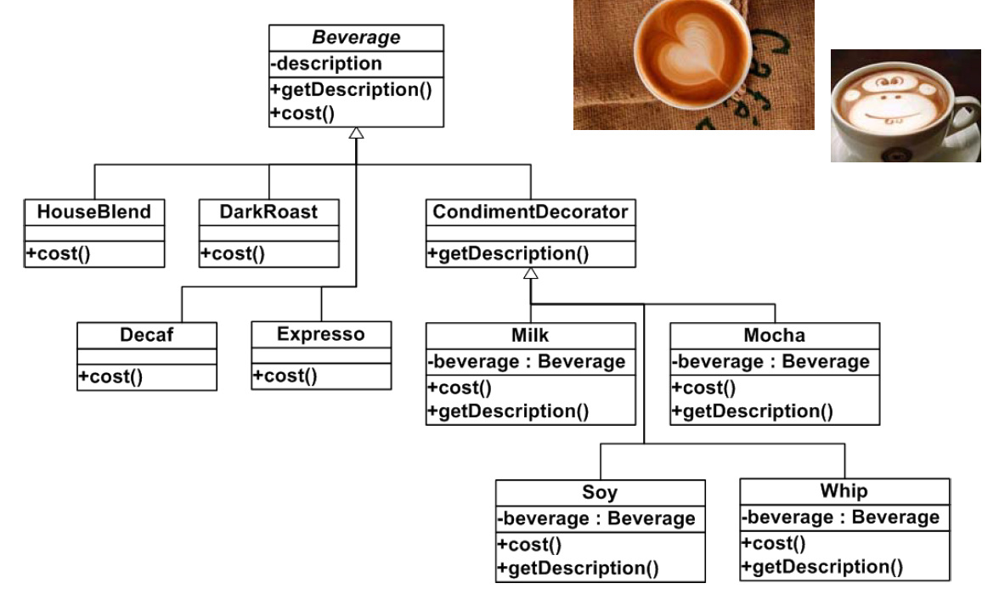

# Decorator Pattern

## 정의
객체에 추가적인 요건을 동적으로 첨가한다.  
데코레이터는 서브클래스를 만드는 것을 통해서 기능을 유연하게 확장할 수 있는 방법을 제공한다.

즉, 객체에 동적으로 새로운 책임(상태, 행위)를 추가할 수 있도록 해주는 패턴  
예) 케이크 장식 : 케이크를 과일로 장식해도 여전히 케이크

## 헬로퍼스트 예제

- 새로운 주문시스템을 만들고 싶음
  - 가격 계산이 주목적(cost())
 - 커피 주문시 추가 요구 사항요구사항(모카, 두유 등)이 있을 수 있음

위 처럼 만들었을 경우, 아래 그림과 같은 문제점이 생겼다.

1. 관리가기 힘들 정도로 엄청난 클래스 개수  
2. 확장성이 안 좋음  
=> 새로운 첨가물이 생기면 또 새로운 클래스를 만들어줘야 함

아래와 같이 구조를 변경 해 보는 것을 생각함(데코레이터 패턴)

 - 주 목적은 가격 계산
   - 각각의 커피, 첨가물마다 가격을 가지고 있음
 - 위의 그림과 같이 커피 위에 첨가물을 덮어 씌우는 방식

데코레이터 패턴은 아래와 같다.

데코레이터 패턴에 해당하는 커피 예제를 다이어 그램으로 아래와 같이 표현 할 수 있다.

## 데코레이터 특징
- 장점  

1. 서로 독립적인 기능들을 구성으로 뭉치므로 응집력이 높아질 수 있음
2. 유연하게 객체에 상태 또는 행동을 추가 할 수 있음
3. 중복되는 상태 또는 행동을 추가하기도 쉬움

- 단점  

1. 클래스가 비교적 많이 정의 될 수 있음(첫번째 예제보다는 훨씬 덜 하겠지만...)
2. 구성 요소들(위 예제에서는 첨가물)을 초기화하는데 코드가 복잡 해 질 수 있음

- 기타  
 데코레이터의 구성요소들을 생성할때 팩토리 패턴이나 빌더 패턴을 적용하기도 함

## 데코레이터 쓰임새
- 자바 I/O(Java Stream)
- 게임 케릭터의 능력치 부가 수치
- site mesh  - 데코레이터 패턴이 적용된 레이아웃 프레임워크 