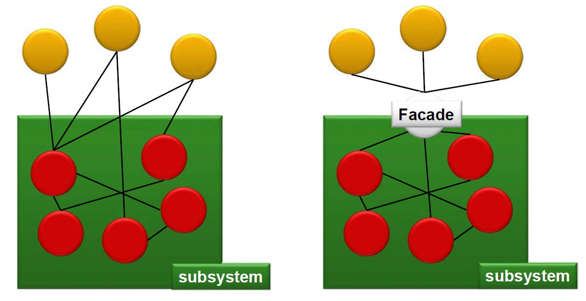
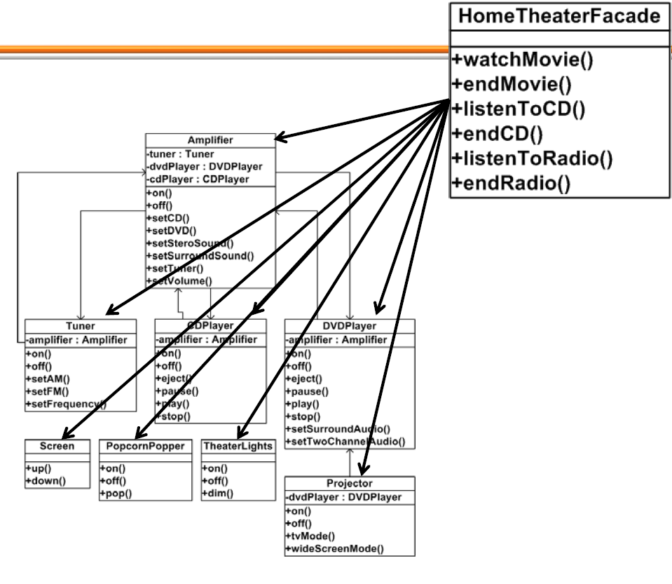
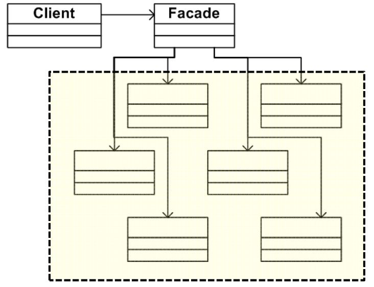

# Facade Pattern(퍼사드는 다시 봐도 뭐하는 놈인지 모르겟다)

### Facade : 프랑스어로 '건물의 정면' 의미

## 정의
어떤 서브 시스템의 일련의 인터페이스에 대한 통합된 인터페이스를 제공한다.  
퍼사드에서 고수준 인터페이스를 서브시스템을 더 쉽게 사용 할 수 있다.(뭔말?)



## 헬로퍼스트 예제

까다롭게 영화 보기

1. 팝콘 기계를 켠다
2. 팝콘 튀기기 시작
3. 전등 어둡게 조절
4. 스크린을 내린다
5. 프로젝터를 켠다
6. 프로젝터로 DVD 신호가 입력되도록 한다
7. 프로젝터를 와이드 스크린모드로 전환한다
8. 앰프를 켠다
9. 앰프 입력을 DVD로 전환하다
10. 앰프를 서라운드 음향모드로 전환한다
11. 앰프 볼륨을 중간으로 서렂ㅇ한다
12. DVD 플레이어를 켠다
13. DVD를 재생한다

위의 일련의 행동을 하려면 아래와 같은 코드로 작성할 수 있다.

```java
popcornMachine.on();
popcornMachine.pop();

light.dim(5);

screen.down();

projector.on();
projector.setInput(dvd);
projector.wideScreenMode();

amplifier.on();
amplifier.setDvd(dvd);
amplifier.setSurroundSounde());
amplifier.setVolume(5);

dvdPlayer.on();
dvdPlayer.play();
```

위 코드를 보면, 영화 보기 라는 하나의 행동을 하는 것에도 대충 6개 정도의 클래스가 필요한 것을 할 수 있다.
그리고 또 영화가 끝나면??  
CD나 라디오 들을 때도 이렇게 복잡한가??  
==> 이럴 때 사용하는게 퍼사드 패턴(흠... 실무에는 어디다 적용?? 서비스단???)  
==> 물론 위의 코드가 복잡하지만 해당 시스템을 직접 건드리고 싶다면 위의 코드처럼 사용해도 되는데, 단순하게 사용하려면 퍼사드 패턴 ㄱ

위의 코드에 퍼사드 패턴을 적용한 다이어그램을 보자.




결론은 하나의 Facade 클래스에 필요한 동작을 묶어서 다 때려 박아 놓은게 Facade Pattern???



클라이언트 입장에서 굉장히 단순하게 사용할 수 있는데, 스프링 환경에서는 서비스단에서 여러 DAO나 다른 BO 로직 가져와서 사용하니까... 굳이 적용할만한데가....

## 의문
- Facade 패턴을 적용하면 하위 레벨 객체들에 대한 접근이 봉쇄되는 것은 아닌가?  
=> 아니다. Facade 패턴이 단순화된 인터페이스를 만들어 주지만, 원하면 각 서브시스템의 객체들도 직접 접근해서 사용 해도 된다.

- Facade 패턴은 단순한 통로 역할 아닌가?  

- 각 서브 시스템은 하나의 Facade만을 가지는가?  
=> 아니다. 여러 개로 해도 됨. 대신에 어떻게 관리할 건지 또 고민을 해야 겠지...

- 비슷한 패턴으로 Adapter가 있는데 둘의 차이는?  
=> Adapter는 인터페이스를 바꾸어주기 위한 것이고, Facade는 인터페이스를 단순화시켜 주기 위한 것(흐음..........)